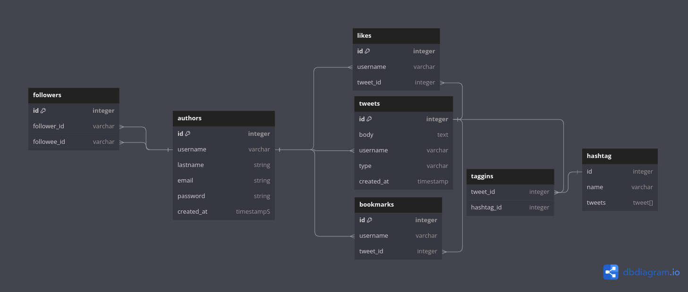

# README

Twitter database model Miguel Lopez 

* Explanation

This database was designed with the following functionalities in mind:

* Tweet replies 
* Bookmark tweets
* Like twets
* Quote tweets
* Retweet a tweet
* Follow another user (author)

Lets start by explaining the authors table, this table consists of the following columns:

*  id: unique identifier for every user (used to relate to other tables )
* username: The name displayed for every author 

* lastname: Users last name for additional identification 

* email: User's email for registration purpuses 

* password: user's password used to log in

* The table followers has two columns, follower_id and followee_id which reference the table authors, column id. the table followers hosts the 'events' when a user follows another user so the relationship with the authors table is one to many since there can be various occurrences of the same author in the table (because a user can be followed multiple times and can follow multiple users)

* The table likes has a userneme column that references the auhtors table to see who has liked a specific post 

* The table tweets has a column username which references the author table to see which user wrote that specific tweet

* The table bookmarks has a column username that references the id column of the table authors to determine which user saved that specific post and a tweet_id that references the tweets table to determine which post was saved by the user

* The table tweets has been created in such a way that we dont have to create multiple tables for quote tweets, tweet replies because since those are all a type of tweet it is mor efficient to add a type column in the tweets table to determine later what to do with the 

