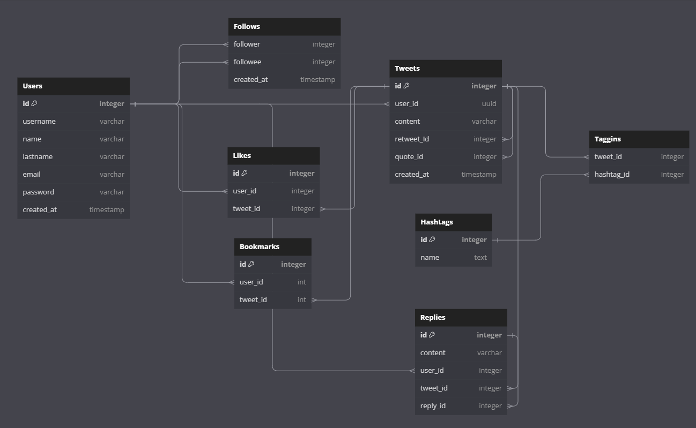

# README

Explanation of database schema:

This tweeter database es composed by a several entities:

user which is the main entity can publish many tweets

tweets are composed by a single user

a tweet can be retweeted so that retweet obtains a reference of the tweet it tweeted.
a quote does the same thing.
a reply is similar but the difference is that it has content on it.

this three kind of tweets they all have a reference to a user, because a tweeet is made from one
author. so it's a one to many relationship. 

likes: 
a user can like any tweet

bookmarks:
many users can bookmark many tweets
a user can have many bookmarks
a tweet can be bookmarked by many people.