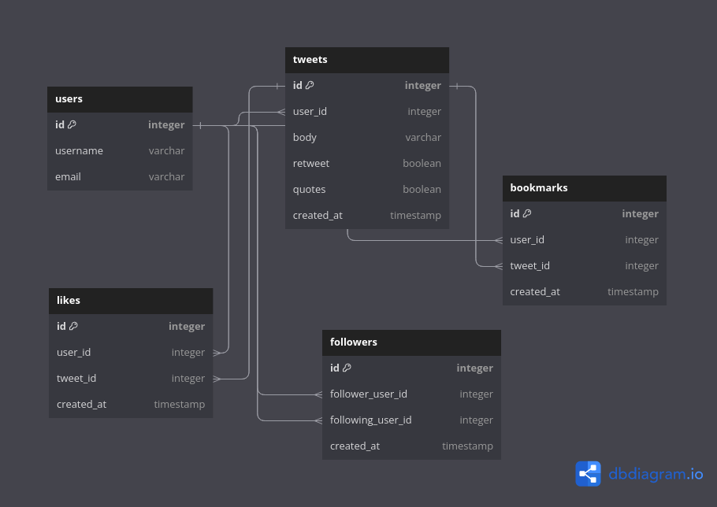

# README

## Application based on the Twitter database

### Features:

* Tweet Reply
* Bookmark
* Likes
* Quotes
* Retweets
* Followers

### Classes

In this section I going to list all the classes that were created in order to achieve the practice-lab goal:

* User
* Bookmark
* Like
* Tweet
* Followers

With these model classes in place, you can now use ActiveRecord to interact with your database tables in your Ruby on Rails application. 

### Schema

The provided code is an example of a database schema definition in Ruby on Rails using ActiveRecord. In this schema definition, tables for a social media platform or a similar application are being created, including tables for users, tweets, bookmarks, followers, and likes. Let me break down the schema for you:

* ActiveRecord::Schema[7.0].define(version: 2023_09_19_160554):
    This line specifies the schema definition and its version. The 7.0 indicates the version of ActiveRecord being used. The version: 2023_09_19_160554 specifies the schema version with a timestamp.

* create_table "bookmarks", force: :cascade do |t|:
    This block creates a table named "bookmarks" with the following columns:
        users_id (a foreign key to users)
        tweets_id (a foreign key to tweets)
        created_at (a timestamp)
    Indexes are also created on the tweets_id and users_id columns.

* create_table "followers", force: :cascade do |t|:
    This block creates a table named "followers" with the following columns:
        follower_user_id (a foreign key to users, representing the follower)
        following_user_id (a foreign key to users, representing the user being followed)
        created_at (a timestamp)
    Indexes are also created on the follower_user_id and following_user_id columns.

* create_table "likes", force: :cascade do |t|:
    This block creates a table named "likes" with the following columns:
        users_id (a foreign key to users)
        tweets_id (a foreign key to tweets)
        created_at (a timestamp)
    Indexes are also created on the tweets_id and users_id columns.

* create_table "tweets", force: :cascade do |t|:
    This block creates a table named "tweets" with the following columns:
        users_id (a foreign key to users)
        body (a text field for the content of the tweet)
        retweet (a boolean indicating if the tweet is a retweet)
        quotes (a boolean indicating if the tweet is a quote)
        created_at (a timestamp)
    An index is created on the users_id column.

* create_table "users", force: :cascade do |t|:
    This block creates a table named "users" with the following columns:
        name (a string for the user's name)
        email (a string for the user's email address)

* Same foreing key twice
add_foreign_key "followers", "users", column: "follower_user_id" and      add_foreign_key "followers", "users", column: "following_user_id":
    These lines add foreign key constraints to the "followers" table, linking the follower_user_id and following_user_id columns to the "users" table. This enforces referential integrity in the database, ensuring that these columns reference valid user IDs

### Database Diagram

