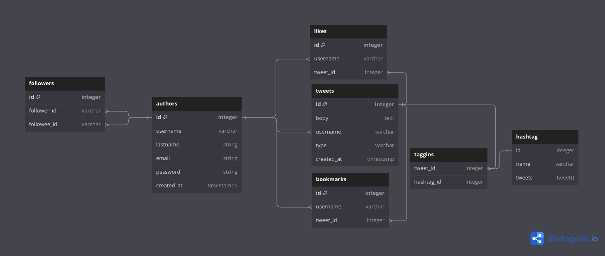

# README

Twitter database model Miguel Lopez 

* Explanation

This database was designed with the following functionalities in mind:

* Tweet replies 
* Bookmark tweets
* Like twets
* Quote tweets
* Retweet a tweet
* Follow another user (author)

Let's define a starting point, lets start by explaining the authors table, 

